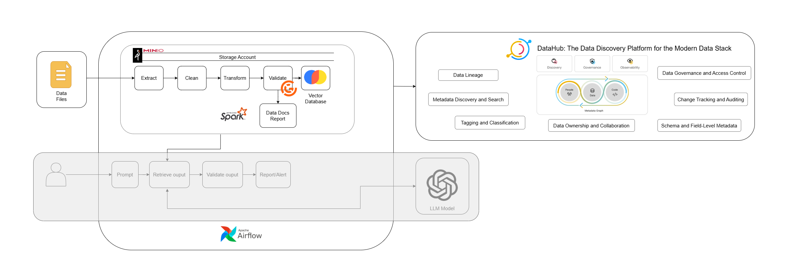

# Vietnamese News RAG Pipeline

A production-ready **Retrieval-Augmented Generation (RAG)** pipeline
built for Vietnamese news articles using **Apache Airflow**, **MinIO**,
**ChromaDB**, and **Sentence Transformers**.\
This system automates the ingestion, validation, embedding, and
retrieval of news data to power downstream applications such as chatbots
and question-answering systems.



## 🔧 Key Features

-   **Automated ETL Pipeline with Airflow**\
    Scrapes, cleans, validates, and embeds Vietnamese news articles
    end-to-end.

-   **Reliable Storage using MinIO**\
    Stores raw and processed data in an S3-compatible object store.

-   **Vector Search with ChromaDB**\
    Provides fast, persistent embedding storage for retrieval.

-   **Data Quality with Great Expectations**\
    Ensures valid and trustworthy processed data.

-   **Custom Dockerized Environment**\
    Fully isolated reproducible setup including Chrome/Chromedriver for
    Selenium scraping.

## 📦 Prerequisites

Before you begin, ensure the following:

-   **Docker Engine** installed on your system.

-   Create required directories in the project root:

        chroma_db/
        config/
        logs/
        minio_data/
        gx/         # Great Expectations context

-   (Optional) Create a `.env` file for environment variable overrides.

## 🚀 Getting Started

### 1. Build Custom Airflow Image

Includes Python dependencies, Great Expectations, and Chromium for
Selenium.

``` sh
docker build -t custom-airflow:latest .
```

### 2. Start All Services

``` sh
docker compose up -d
```

### 3. Verify Containers

``` sh
docker ps
```

## 🌐 Accessing System Interfaces

| Service | URL | Credentials |
| :--- | :--- | :--- |
| **Airflow UI** | http://localhost:8080/login | `airflow` / `airflow` |
| **MinIO UI** | http://localhost:9001/login | `minioadmin` / `minioadmin` |

## 🗂️ Initial MinIO Setup

Inside MinIO UI, create the following buckets:

-   `landing` --- raw scraped HTML and metadata\
-   `staging` --- cleaned, chunked, and validated data

## 📁 Project Structure

    ├── dags/
    │   ├── chatbot.py
    │   ├── common_functions.py
    │   ├── ingest_data.py
    │   └── vn_rag_pipeline.py
    ├── chroma_db/
    ├── config/
    ├── gx/
    ├── minio_data/
    ├── requirements.txt
    ├── Dockerfile
    ├── docker-compose.yaml
    ├── README.md
    └── .gitignore

### Folder Details

-   **dags/** -- All Airflow tasks and pipeline definitions\
-   **gx/** -- Great Expectations configuration and generated
    documentation\
-   **chroma_db/** -- Persistent vector database storage\
-   **minio_data/** -- MinIO volume data\
-   **Dockerfile** -- Custom Airflow image (includes Chromium &
    drivers)\
-   **docker-compose.yaml** -- Multi-service orchestration (Airflow,
    Redis, MinIO, PostgreSQL)

## 🔄 Pipeline Overview

### 1. **Web Scraping (Ingest News)**

-   Scrapes Vietnamese news articles from **vnexpress.net** using
    Selenium.
-   Saves raw HTML, text, and metadata to the MinIO `landing/` bucket.

### 2. **Data Cleaning & Chunking**

-   Removes boilerplate, ads, and unused HTML.
-   Generates well-sized text chunks for embedding.
-   Prepares JSON/Parquet files in the `staging/` bucket.

### 3. **Data Quality Validation**

-   Uses **Great Expectations** to validate:
    -   Null values\
    -   Text length\
    -   Metadata completeness\
    -   Source formatting

### 4. **Embedding & Vector Storage**

-   Embeds article chunks using **Sentence Transformers**.
-   Stores embeddings + metadata in **ChromaDB** for fast retrieval.

## ▶️ Running the Pipeline

1.  Open the **Airflow UI**
2.  Locate DAG: `vn_rag_pipeline`
3.  Turn on the DAG + trigger a run\
4.  Monitor progress within Airflow Logs & Graph View\
5.  Embedded vectors will appear in `chroma_db/` automatically

## 🛠️ Troubleshooting Tips

-   **Chrome / ChromeDriver Issues**\
    Already handled in the Dockerfile. If issues occur, rebuild the
    image:

    ``` sh
    docker build --no-cache -t custom-airflow:latest .
    ```

-   **Containers failing to start**\
    Check logs:

    ``` sh
    docker compose logs service_name
    ```

-   **ChromaDB not persisting data**\
    Ensure `chroma_db/` directory has write permissions.

-   **Selenium timing out**\
    Increase WebDriver wait time in `ingest_data.py`.

## 📜 License

This project is licensed under the **Apache License 2.0**.\
See `docker-compose.yaml` and related files for details.
